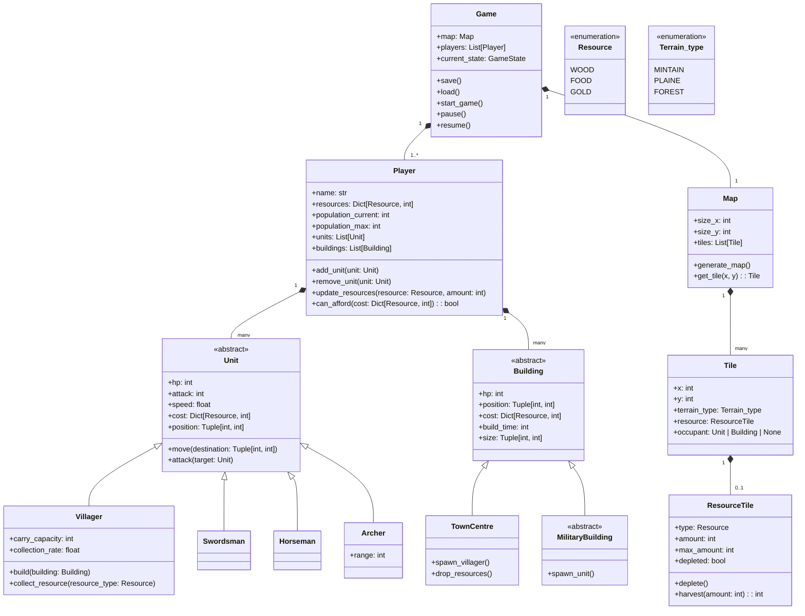

```mermaid
classDiagram
    class Game {
        +map: Map
        +players: List[Player]
        +current_state: GameState
        +save()
        +load()
        +start_game()
        +pause()
        +resume()
    }

    class Resource {
        <<enumeration>>
        WOOD
        FOOD
        GOLD
    }

    class Terrain_type {
        <<enumeration>>
        MINTAIN
        PLAINE
        FOREST
    }

    class Map {
        +size_x: int
        +size_y: int
        +tiles: List[Tile]
        +generate_map()
        +get_tile(x, y): Tile
    }

    class Tile {
        +x: int
        +y: int
        +terrain_type: Terrain_type
        +resource: ResourceTile
        +occupant: Unit | Building | None
    }

    class ResourceTile {
        +type: Resource
        +amount: int
        +max_amount: int
        +depleted: bool
        +deplete()
        +harvest(amount: int): int
    }

    class Player {
        +name: str
        +resources: Dict[Resource, int]
        +population_current: int
        +population_max: int
        +units: List[Unit]
        +buildings: List[Building]
        +add_unit(unit: Unit)
        +remove_unit(unit: Unit)
        +update_resources(resource: Resource, amount: int)
        +can_afford(cost: Dict[Resource, int]): bool
    }

    class Unit {
        <<abstract>>
        +hp: int
        +attack: int
        +speed: float
        +cost: Dict[Resource, int]
        +position: Tuple[int, int]
        +move(destination: Tuple[int, int])
        +attack(target: Unit)
    }

    class Villager {
        +build(building: Building)
        +collect_resource(resource_type: Resource)
        +carry_capacity: int
        +collection_rate: float
    }

    class Swordsman 
    class Horseman 
    class Archer {
        +range: int
    }

    class Building {
        <<abstract>>
        +hp: int
        +position: Tuple[int, int]
        +cost: Dict[Resource, int]
        +build_time: int
        +size: Tuple[int, int]
    }

    class TownCentre {
        +spawn_villager()
        +drop_resources()
    }

    class MilitaryBuilding {
        <<abstract>>
        +spawn_unit()
    }

    Game "1" *-- "1..*" Player
    Game "1" *-- "1" Map
    Map "1" *-- "many" Tile
    Tile "1" *-- "0..1" ResourceTile
    Player "1" *-- "many" Unit
    Player "1" *-- "many" Building

    Unit <|-- Villager
    Unit <|-- Swordsman
    Unit <|-- Horseman
    Unit <|-- Archer

    Building <|-- TownCentre
    Building <|-- MilitaryBuilding

    %% note ResourceTile: Wood (W): 100 per tile\nFood (F): 300 per farm\nGold (G): 800 per tile
```
