# Python-projet
Projet python du 1er semestre de 3A à l'INSA CVL. 

Le but est de développer le jeu "Age of Empire". Le jeu est développé en python et ne peux être joué que par deux IA sur 2 sorties différentes :  
- terminale
- 2.5D

```mermaid
---
title: Diagram UML of the Model
---
classDiagram
  class Ressource{
    - Enum~Type~ type
    - int quantity
    - char symbol
    + Ressource(type,symbol, quantity)
  }

  class Type{
    <<enumeration>>
    Gold
    Wood
  }

class Tile{
  - (int,int) position
  - Ressource ressource
  + Tile(position,ressource)
}

note for Tiles "Un composition indique que si l'objet Tile est détruit alors l'objet Ressource associé est aussi détruit. Ici la ressource dépend de la case ou il est."

Ressource  --  Type
Tile --* Ressource : composition

class Building{
    cost: int
    size: int
    pos: Pos
    hp: int
    build_time: int
    symbol: char
    etat: int[3]

    +Building(): void
    +update(): void
    +destroy(): void
    +damage(unit: Unit):int

}
class Towncentre extends Building{

    +add_resources(): void
    +remove_resources(): void
    +towncentre(): void

}
class House extends Building{
    +house(): void
}
class Camp extends Building{
    +camp(): void
}
class Farm extends Building{
    stockage: 300 

    +product(): void

}
class Barracks extends Building{
     +create_swordsman(): void
}
class Stable extends Building{
     +create_horseman(): void
}
class Archery_Range extends Building{
     +create_archery(): void
}
class Keep extends Building{
    attack: 5
    range: 8

    +Keep(): Void
    +attack(): Void

}

class Unit {
  cost int[3]
  trainingTime: time
  hpMax: int
  speedatk: float
  speeddep: float
  symbol: char
  attack: int
  hp: int
  position: Pos
  
  +init(): void
  +getHp(): int
  +getPos(): Pos
  +hpLoss(amount: int): void
  +die(): void
  +move(position: Pos): void
  +create_path(pos: Pos): void
  +attack(): void
}

class Villager extends Unit {
  +collect(Resource resource): void
  +dropResources(): void
  +build(Building building): void
}

class Swordsman extends Unit {
}

class Horseman extends Unit {
}

class Archer extends Unit {
}

```

